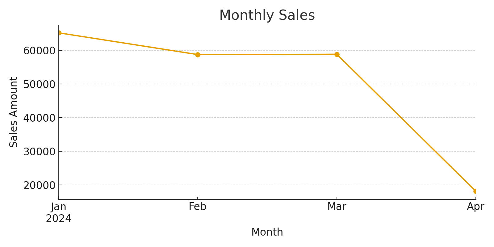

# sales-report-portfolio

# 売上データ集計レポート（ポートフォリオ）

このリポジトリは、売上データを用いた集計・可視化レポートのサンプルです。  
クラウドソーシング応募時に「成果物イメージ」を共有するために作成しました。

## 内容
- **データ:** sales_data.csv（サンプル100行）
- **処理:**
  - 月別売上推移（折れ線グラフ）
  - 商品別売上トップ5（横棒グラフ）
  - 店舗別売上シェア（円グラフ）
  - 曜日別売上（棒グラフ）

## 成果物
- [PDFレポート](Sales_Report_Portfolio.pdf)
- [Jupyter Notebook](sales_report_notebook.ipynb)
- [Pythonスクリプト](sales_report.py)

## サンプル出力

